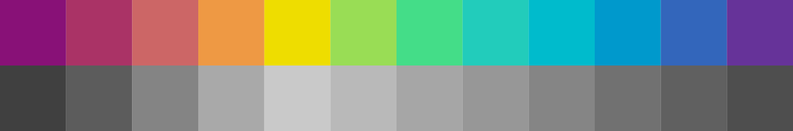

# The 12-bit rainbow palette

I designed the 12-bit rainbow palette for use in my data visualisations. It
consists of twelve colours chosen with consideration for how we perceive hue,
chroma, and luminance: 

The palette uses a 12-bit colour depth, so each colour requires only four
characters when specified as a hexadecimal colour code in a CSS or SVG file: 

## Designing the palette

Computers define colours in terms of red, green, and blue components, which are
treated equally. However, we perceive these components as having differing
luminance: compared to a pure red, a pure green looks much brighter and a pure
blue looks much darker. As a result, a simple RGB rainbow palette has large
changes in luminance between neighbouring colours. This can be seen by
converting colours to greys of equal perceived luminance:

The HCL colour space is an alternative to the RGB colour space that defines
colours in terms of hue, chroma, and luminance components. These components are
perceptually uniform, which means that a change by a particular numerical
amount will be perceived similarly for any colour.

An HSL rainbow colour palette can be created by choosing fixed chroma and
luminance values and varying the hue. However, the resulting palette looks
unpleasant because yellow is darkened to brown, red is lightened to pink, and
blue becomes very pale.

A better approach is to allow the luminance to vary, but in a controlled way.
Yellow is given the highest luminance, as it only looks yellow when bright.
After choosing two other colours - a red and a blue in this case - the
luminance can then be calculated for the other hues.

Using a 12-bit colour depth limits the available colours, so slight changes to
hue, chroma, and luminance must be made, but these are small enough not to be
noticeable. The resulting palette has evenly-spaced hues, only small variations
in chroma, and smoothly increasing and decreasing luminance: 

---
*Source*: [iamkate.com](https://iamkate.com/data/12-bit-rainbow/)

