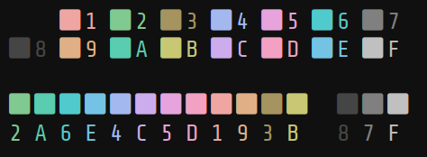

# Qualitative Color Palette

It has the following properties:
- a 12 color "wheel" that excludes chartreuse (green-yellow) in favor of
amber/brown (orange-yellow)

- every color has the same perceived brightness and saturation, except amber,
gray (which have the same brightness) and dark-gray

- great for syntax highlighting and git diffs

- bold represents an adjacent color shift, rather than one of brightness
(except for the gray scale and amber/yellow)

